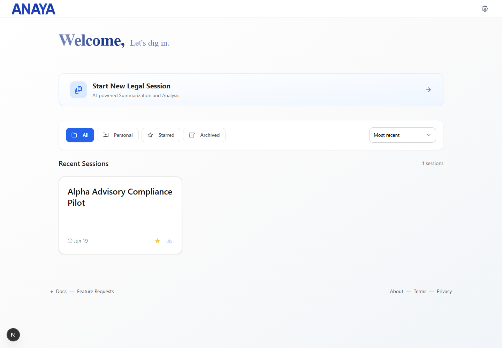
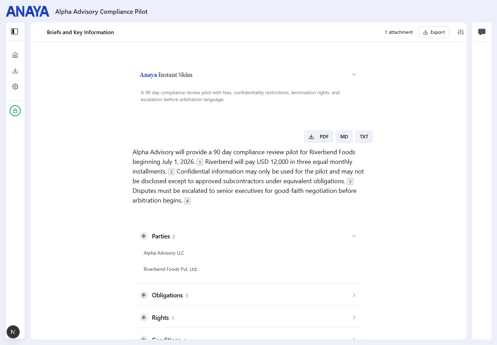
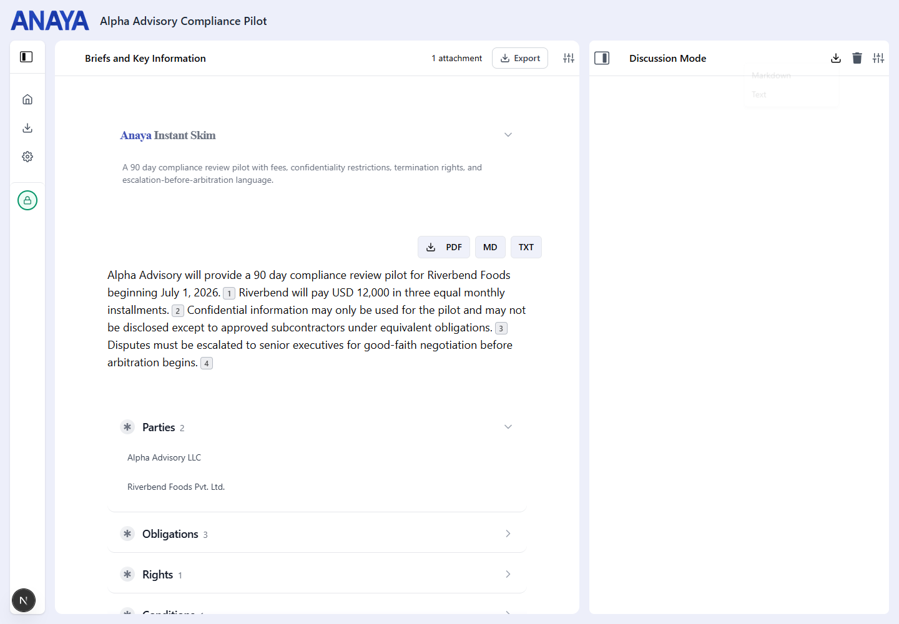

# Anaya

Anaya is a local-first legal document workspace for reading, summarizing, and discussing legal text. It is built as a focused private tool rather than a cloud collaboration product: sessions live in the browser, documents are extracted locally where possible, and exports are first-class.

The current product direction is deliberately narrow: a fast private legal reading room for PDFs, DOCX files, images, plain text, summaries, citations, and chat transcripts.

## Screenshots

### Local Session Dashboard



### Legal Summary Workspace



### Summary Export Menu


### Chat Export Menu



## What It Does

- Creates private legal sessions in the current browser.
- Offers a ClaimBrief route for US property-insurance claim packet review.
- Offers a ClaimBrief packet-intake instruction route for safe redacted-file handoff.
- Offers a ClaimBrief paid-pilot scope route that works with or without payment links.
- Extracts text from PDF, DOCX, image, TXT, and Markdown files.
- Uses local parsing, PDF text extraction, OCR, and sentence chunking before AI calls.
- Generates quick skims, structured summaries, source-linked legal points, and legal ontology fields.
- Lets users ask follow-up questions grounded in the generated summary.
- Exports summaries as PDF, Markdown, and TXT.
- Exports chat transcripts as Markdown and TXT.
- Avoids accounts, Firebase, analytics, pricing pages, referral flows, and cloud session storage.

## Privacy Model

Anaya is local-first, not fully offline.

Data that stays local:

- Session index and session content are stored in `window.localStorage`.
- Uploaded files are processed in the browser.
- Extracted paragraphs, summaries, quick skim text, and chat history are saved only in browser storage.
- Exported files are generated client-side and downloaded by the browser.

Data that can leave the device:

- Summary and chat requests send document-derived text to local Next.js API routes.
- Those routes call OpenAI using the server-side `OPENAI_API_KEY`.

There is no browser-exposed OpenAI key, no Firebase client, no Firestore writes, and no Google Analytics in the current app.

## Architecture Docs

- [Architecture](docs/ARCHITECTURE.md)
- [Technical Details](docs/TECHNICAL_DETAILS.md)
- [Business Decisions](docs/BUSINESS_DECISIONS.md)
- [Local Private Migration Notes](docs/LOCAL_PRIVATE_MIGRATION.md)
- [US ClaimBrief Go-To-Market](docs/US_CLAIMBRIEF_GO_TO_MARKET.md)
- [ClaimBrief Outreach Emails](docs/outreach/claimbrief-email-sequence.md)
- [ClaimBrief Lead Template](docs/outreach/claimbrief-leads-template.csv)
- [ClaimBrief Prospect List](docs/outreach/claimbrief-prospects-2026-07-02.csv)
- [ClaimBrief Send Queue](docs/outreach/claimbrief-send-queue-2026-07-02.md)
- [ClaimBrief Reply And Close Playbook](docs/outreach/claimbrief-reply-and-close-playbook.md)
- [ClaimBrief First Sale Runbook](docs/outreach/claimbrief-first-sale-runbook.md)
- [ClaimBrief Sample Fulfillment Kit](docs/outreach/claimbrief-sample-fulfillment-kit.md)
- [ClaimBrief Outbound Compliance Checklist](docs/outreach/claimbrief-outbound-compliance-checklist.md)
- [ClaimBrief Pipeline Tracker](docs/outreach/claimbrief-pipeline-tracker.csv)
- [ClaimBrief Direct Email Mailmerge](docs/outreach/generated/claimbrief-direct-email-mailmerge-2026-07-02.csv)
- [ClaimBrief Contact Form Messages](docs/outreach/generated/claimbrief-contact-form-messages-2026-07-02.csv)
- [ClaimBrief Send Board](docs/outreach/generated/claimbrief-send-board-2026-07-02.html)
- [ClaimBrief Form/Call Sprint](docs/outreach/generated/claimbrief-form-call-sprint-2026-07-02.html)
- [ClaimBrief Send Readiness Report](docs/outreach/generated/claimbrief-send-readiness-report-2026-07-02.md)
- [ClaimBrief Pipeline Summary](docs/outreach/generated/claimbrief-pipeline-summary-2026-07-02.md)
- [ClaimBrief Command Center](docs/outreach/generated/claimbrief-command-center-2026-07-02.html)
- [ClaimBrief Sample Review Packet](public/samples/claimbrief-sample-review.html)

## Tech Stack

- Next.js 15 App Router
- React 18
- TypeScript
- Tailwind CSS
- Zustand for client state
- OpenAI Node SDK in server routes
- PDF.js, Mammoth, Tesseract.js, wink-nlp
- React PDF renderer for summary PDF export

## Getting Started

Install dependencies:

```bash
npm install
```

Create a local environment file:

```bash
OPENAI_API_KEY=your_server_side_key

# Optional ClaimBrief sales links. If unset, CTAs use manual-invoice email fallbacks.
CLAIMBRIEF_POSTAL_ADDRESS="Your compliant mailing address"
CLAIMBRIEF_SAMPLE_URL=https://app.anaya.legal/samples/claimbrief-sample-review.html
NEXT_PUBLIC_CLAIMBRIEF_CONTACT_EMAIL=hello@anaya.legal
NEXT_PUBLIC_CLAIMBRIEF_STARTER_URL=https://buy.stripe.com/...
NEXT_PUBLIC_CLAIMBRIEF_MONTHLY_URL=https://buy.stripe.com/...
NEXT_PUBLIC_CLAIMBRIEF_WHITELABEL_URL=https://buy.stripe.com/...
```

Run the app:

```bash
npm run dev
```

Open:

```text
http://localhost:9002
```

## Verification Commands

```bash
npm run lint
npm run typecheck
npm run outreach:claimbrief
npm run outreach:claimbrief:check
npm run outreach:claimbrief:tracker
npm run outreach:claimbrief:dashboard
npm run outreach:claimbrief:form-call-sprint
npm audit --omit=dev
npm run build
```

The latest verified build route table only includes:

- `/`
- `/claimbrief`
- `/claimbrief/intake`
- `/claimbrief/pilot`
- `/s/[sessionId]`
- `/api/ai/chat`
- `/api/ai/quick-skim`
- `/api/ai/summarize`

## Important Caveats

- This is not legal advice software. It summarizes and explains provided documents.
- Local sessions are browser-local. Clearing site data or changing browsers removes access unless the user exported files first.
- OpenAI calls are server-side but still transmit document-derived content to OpenAI.
- There is no multi-device sync, team workspace, account system, or cloud backup by design.
