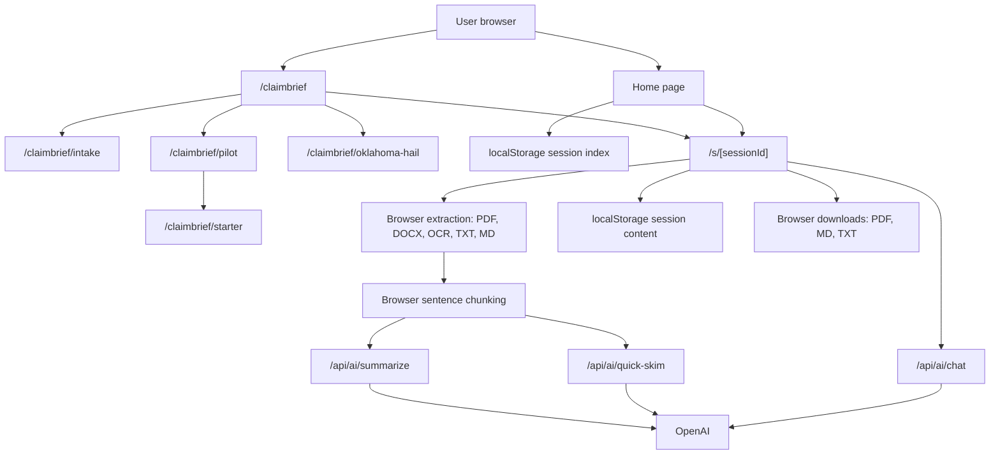

# Architecture

## Current Shape

Anaya is now a local-first Next.js application with a narrow server boundary for AI calls.

## Trust Boundaries

### Browser Boundary

The browser owns:

- File selection and text extraction.
- OCR and PDF parsing.
- Session metadata and content persistence.
- Summary and chat display state.
- Export generation and downloads.

Browser storage keys:

- `anaya-local-sessions`
- `anaya-local-session:<sessionId>`
- Small UI preference keys such as greeting or onboarding state.

### Server Boundary

The server owns:

- OpenAI API key access.
- Request validation and payload limits.
- Prompt construction for summary, quick skim, and chat.
- Sanitized API error responses.

Server routes:

- `POST /api/ai/quick-skim`
- `POST /api/ai/summarize`
- `POST /api/ai/chat`

There are no session persistence APIs today. That is intentional. The current product choice is local browser storage plus explicit export.

Workflow-specific prompting is selected through local settings. The `claim-brief` workflow changes summary, quick skim, and chat prompts without changing the storage model. The `/claimbrief/intake`, `/claimbrief/pilot`, `/claimbrief/starter`, and `/claimbrief/oklahoma-hail` routes are static sales/support surfaces; they do not upload files, create sessions, or persist user data.

## Data Flow

### New Session

1. User clicks `Start New Legal Session`.
2. The client creates a UUID v7 session id.
3. The session route initializes local session metadata.
4. User enters text or uploads documents.
5. Parsed text becomes paragraph records with stable paragraph ids.
6. Summary and quick skim requests are sent through server routes.
7. Results are written back to localStorage.

### ClaimBrief Session

1. User opens `/claimbrief`.
2. The page sets `settings.summary.workflow` to `claim-brief`.
3. The page creates a local session at `/s/{sessionId}?new=true&workflow=claim-brief`.
4. The upload modal asks for policies, denial letters, estimates, and claim correspondence.
5. Summary, quick skim, and chat requests use claim-review prompts and preserve the same local-first storage model.

Supporting sales routes:

- `/claimbrief/intake`: explains redaction and packet requirements for one sample.
- `/claimbrief/pilot`: explains the manual starter/monthly pilot after the sample is useful or a prospect asks price.
- `/claimbrief/starter`: gives the $99 starter-batch close page with checkout-link or manual-invoice fallback.
- `/claimbrief/oklahoma-hail`: gives Oklahoma wind/hail prospects a timely packet-review offer tied to current public claim-handling news.

### Existing Session

1. Home reads `anaya-local-sessions`.
2. Session cards are rendered from local metadata.
3. Opening a card loads `anaya-local-session:<sessionId>`.
4. Summary, quick skim, paragraphs, and chat messages hydrate Zustand state.

### Summary

1. Browser chunks extracted text into `Paragraph[]`.
2. `summarizeParagraphs` posts paragraphs and settings to `/api/ai/summarize`.
3. The server validates shape and size.
4. Paragraphs are batched with a 10,000 token estimate per batch.
5. OpenAI returns JSON-only batch extractions.
6. The server consolidates batches into one `SummaryItem`.
7. The browser saves `SummaryItem` locally.

### Chat

1. User sends a question from the chat panel.
2. Browser appends the user message locally.
3. Browser posts summary context, user input, and recent chat history to `/api/ai/chat`.
4. The server validates payloads and calls OpenAI.
5. Browser saves the assistant response locally.

### Export

Summary export:

- PDF via dynamic `@react-pdf/renderer` import.
- Markdown via Blob download.
- Text via Blob download.

Chat export:

- Markdown transcript.
- Text transcript.

## Removed Architecture

The previous app had a larger and riskier architecture:

- Firebase client initialization.
- Firestore session writes.
- Anonymous-to-authenticated session migration.
- Account, membership, pricing, referral, and share flows.
- Browser-exposed OpenAI key usage.
- Spreadsheet parsing through `xlsx`.
- Analytics wrapper.

Those pieces were removed because they contradicted the local/private product promise and expanded the security surface without serving the current wedge.

## Why This Architecture

This architecture optimizes for:

- Honest privacy positioning.
- Fast local iteration.
- Minimal cloud trust surface.
- Clear export paths instead of cloud sync.
- Lower bundle and dependency surface.

It intentionally does not solve:

- Team collaboration.
- Multi-device sync.
- Account recovery.
- Server-side document storage.
- Enterprise audit logs.

Those should only return if the product direction changes from local legal workspace to hosted legal workspace.
